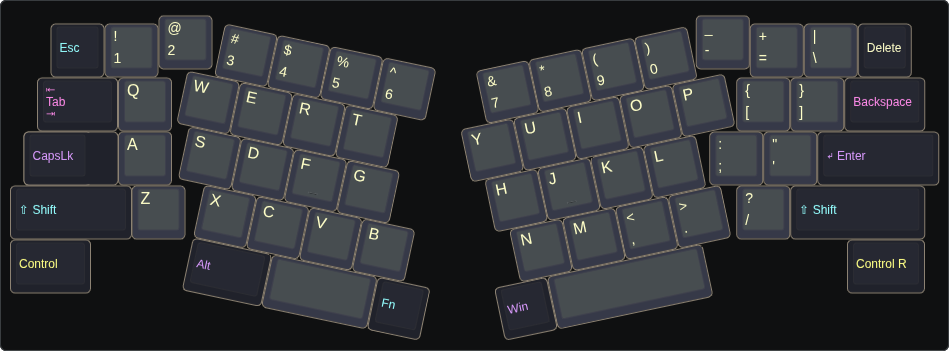
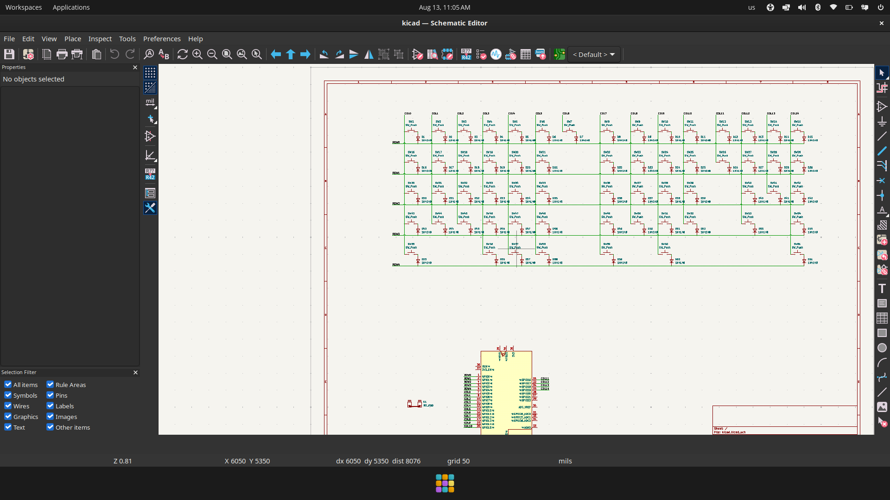
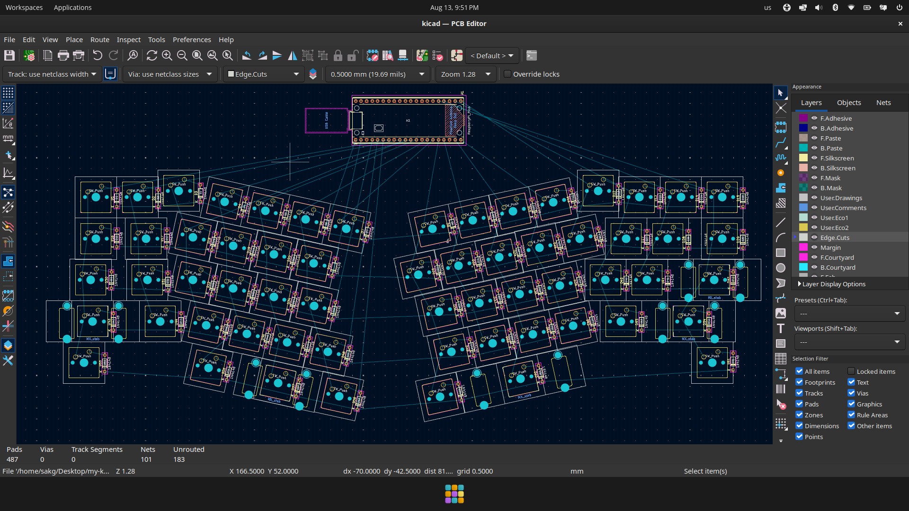
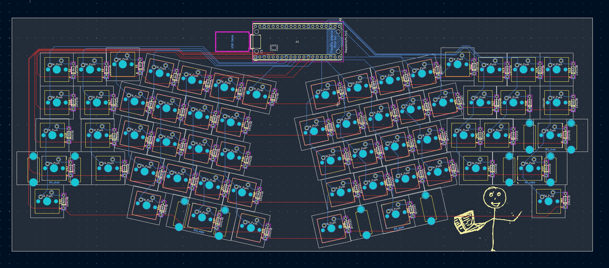
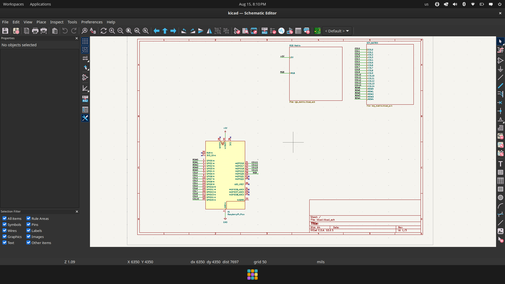
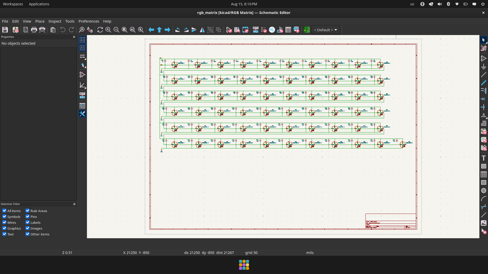
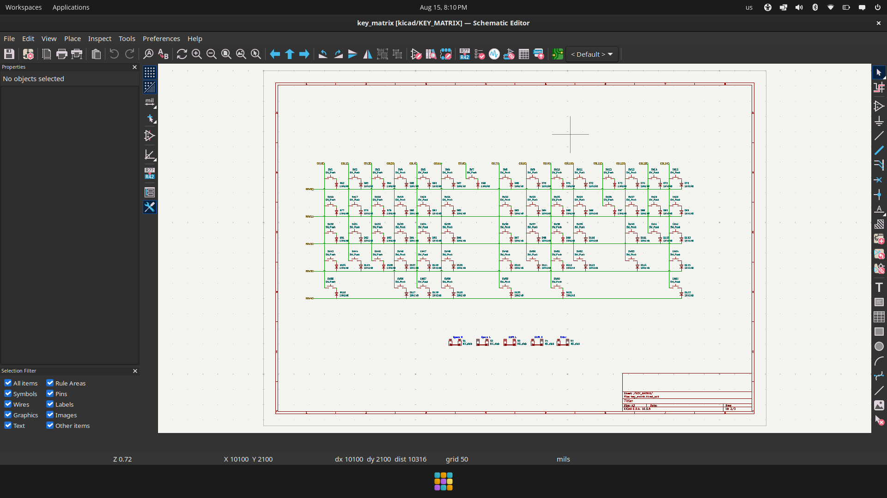
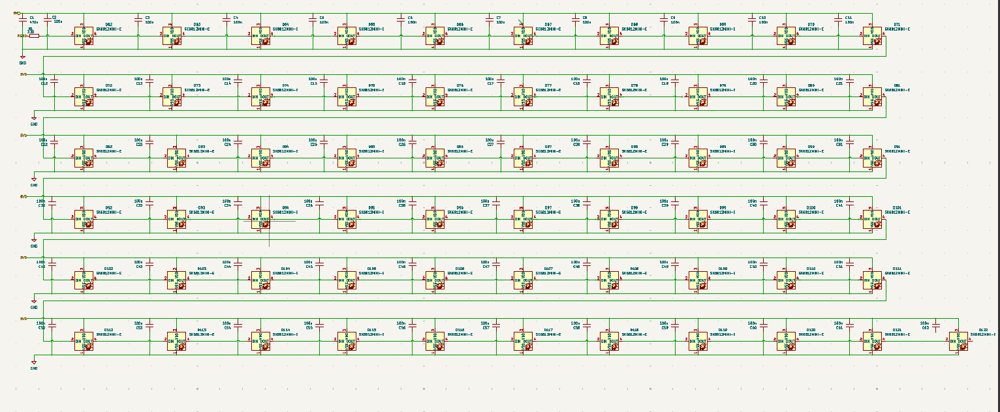

------------
INFO:
 - total logged hr: _
 - source: https://lapse.hackclub.com/user/@sakgdev14
 - tldr: watch me yapping while building keyboard
------------

## Deciding keyboard - Aug 12 - 17:48
Alrit so i guess i wanna build an alice type 60% tactile keyboard. though i have never used bt ig i would go with it..

## Planning and Layout of the keyboard - Aug 12 - 18:32 (took 2h 28m)
It was ig ez and most creative part as i had to do the main thing: Sketching and making layout for the keyboard.
At first i was skatching in krita and was googling abt abt custom alice keyboard and got this repo: https://github.com/floookay/adelheid, and soon realized we can generate layout, so i forked the layout of this repo and started making it my own. sm major changes i did was removing f1-f12 as a result changing position of many corresponding keys and after sm minor changes and wasting 2 hrs, and taking feedback from ppl and ai, i got this:

## Schematics designing - Aug 13 - 6:46 (took 3h 5m)
Attempt 1: i knew nothing abt schematics so after reading the guide i began by installing the plugins in kicad then spent sm time struggling to create project and go to schematics tab. once it was done i began adding all components and joined diode and key switch then imported the keyboard layout as referance and duplicated the diode and switch. then as it was said i started connecting them with rows and colums wire and i was halfway but realized sm of the ends of the switch was too much close or nearly got connected to the column wire so i js deleted the project and started new.
Attempt 2: So i saw other's schematics and found out that instead of keeping it in the alice shape, they did rectangular and then got to know its js to show connection regardless of position then after sm time i finished doing this(duplicating switch/diode) then as told in guide, i labeled rows and cols and attached it with pins and heres the img: 

After this i added 5 stabalizers: 2.25u for shift, shift r, enter, 2u for left space key and 3u for right space key. then for mounting holes, i chose top mount as it seemed it had not much cons and bad ux henxe didn't add mounting holes(as it will be added in case afaik..). then i assigned footprints to every component though many already had and this was all for schematics..
Though i wanted to add rgb lights, and other things but i was worried i might mess up hence decided to build a simple one first..

## PCB Designing - Aug 13 - 18:36 (took 4h 20) - aaaaaa
Ok this was so fun! So after building schematics, i had to build pcb, i started by looking at others as i had no idea abt it, then  i realized here i have to place and design components as i want the keyboard irl. so thats, what i did, i started placing switched and diodes one by one and the hard part was rotating and placing it such that it doesn't conflict.. then i completed it in ~2 hrs, though i am not confirmed whether i did right or not as i jst placed them as i thought was right not with exact measurements. btw this is what i got:

 Alrit so i thought this was all for pcb but got to know now i would have to route traces.. i started by looking  at other's routed board and started mine, i tried routing one row but was confused as the traces were conflicting but soon realized how to do! at first i was trynna making it as clean as possble but at the end got to know that it must be as short as possible hence had to edit and make it short. I used F.Cu for rows and B.Cu for cols. Afterwards, i edited my avatar and used it as silkscreen in the pcb! But the problem was at last in the guide it was said to flood leftover copper traces with gnd but i didn't find gnd :( so i skipped this as DRC was success. heres the routed pcb:

## Restarting Schematics part 1 - Aug 15 - 00:14 (took 2h 45m)
So i jst found out that i messed up in my pcb: using uneven space even smwhere the switch has less area than it needs, etc. as well as i wanted to add rgb backlight (which i wasn't adding as i thought it might be complex but.. worth trying)
Hence i rm rf my project(schemetics was saved in github lel) and started from schematics again. at first i spent an hr revising foundation concepts of electronics and pcb. I named this project keeb-2 as i wanted it to differentiate from first one.
I used the original schematics of prev and started editing it. i looked into others schematics for how they were formatting it and doing rgb and other.
i moved keyboard matrix into new sheet but had no idea how to do input output of wires so spent few time to figure out but failed and jst dmd one person and left it. then did sm formatting inspired by others schematic.
then i started researching abt rgbs and started implementing that, which took a little much time.. but now all the wires of different rows were conflicting so jst i shut down the laptop(didn't cmplt the rgb matrix)

## Schematics Part 2 - Aug 15 - 08:33 (took 2h 54m)
i began the work i had left ystday: rgb matrix, after i did 2 rows. i asked my friend whether i was doing crrect or not and on the same time did sm more research to make sure i am doing correct. then i spent next 40 minutes making it for rest rows(4 more). then i spent sm time understanding how it was working and perfecting it.
Till then my friend had told me how to take input/output in sheets, so jst started encapsulating keyboard matrix and light matrix and replacing text with input pins, tbh it was so satisfying..
So i was neaarly done but few doubts i had: i was choosing GATERON G Pro 3.0 Keyboard Switches, what component and footprint do i have to choose? is it still sw push? then zwhat is diff between 45 deg tilted vs normal switch?, Which mounting is kinda best and do i need mounting holes? and would a single trace of 5V be enough for all 60 rgbs or not.
btw heres the schematics:

## Final Schematics - Aug 16 - 08:31 (took 56m)
so most of my doubt were clear now hence i began doing last part of schematics.
At first instead of providing a single 5v trace to all 61 rgbs, i did 6 seperate, then i added mounting holes even though i am doing gasket mount as it might be useful in future..
Then i started assigning footprint, many were already assigned as i am reusing the prev failed keeb schematics. it might have been faster had i not wanted to know why specific footprint we using. i started with capacitor but realized we also need a large capacitor that would seat near main 5v input b4 other in rgb matrix, so did sm research and used 470 uf capacitor. then added 330 ohm resistor in rgb data before first dinput.
then after verifying that i was doing everything right, i annoted the numbers, then assigned footprint of mounting holes, switch(normal to kailh for hotswappable), resistors and capacitors.
So finally schemetics is done - hopefully. Heres the img of my led matrix as i did few changes: 

