------------
INFO:
 - total logged hr: _
 - source: https://lapse.hackclub.com/user/@sakgdev14
 - tldr: me yapping while building keyboard
 - heading format: TITLE - START_DATE - START_TIME (took HRS MINS (#might be less than sum of lapse as i subtracted pauses i took#)) - [TIMELAPSE_VID1, TIMELAPSE_VID2....]
 - fun fact: it would be my very first mechanical keyboard and its self made >~<
------------

## Deciding keyboard - Aug 12 - 17:48
Alrit so i guess i wanna build an alice type 60% tactile keyboard. though i have never used bt ig i would go with it..

## Planning and Layout of the keyboard - Aug 12 - 18:32 (took 2h 28m) - [[vid1](https://lapse.hackclub.com/timelapse/Xd68zajk7jc4)]
It was ig ez and most creative part as i had to do the main thing: Sketching and making layout for the keyboard.

At first i was skatching in krita and was googling abt abt custom alice keyboard and got this repo: https://github.com/floookay/adelheid, and soon realized we can generate layout, so i forked the layout of this repo and started making it my own. sm major changes i did was removing f1-f12 as a result changing position of many corresponding keys and after sm minor changes and wasting 2 hrs, and taking feedback from ppl and ai, i got this:
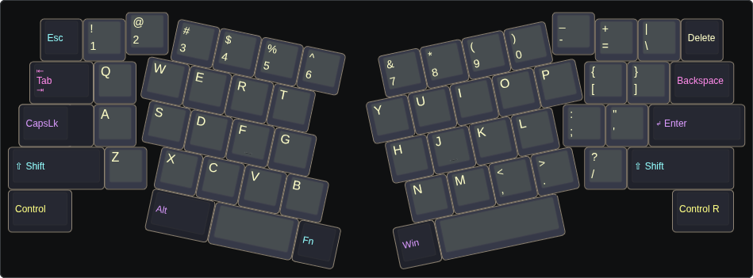

## Schematics designing - Aug 13 - 6:46 (took 3h 5m) - [[vid1](https://lapse.hackclub.com/timelapse/cqDWx0sxkFup)]
Attempt 1: i knew nothing abt schematics so after reading the guide i began by installing the plugins in kicad then spent sm time struggling to create project and go to schematics tab. once it was done i began adding all components and joined diode and key switch then imported the keyboard layout as referance and duplicated the diode and switch. then as it was said i started connecting them with rows and colums wire and i was halfway but realized sm of the ends of the switch was too much close or nearly got connected to the column wire so i js deleted the project and started new.

Attempt 2: So i saw other's schematics and found out that instead of keeping it in the alice shape, they did rectangular and then got to know its js to show connection regardless of position then after sm time i finished doing this(duplicating switch/diode) then as told in guide, i labeled rows and cols and attached it with pins and heres the img: 
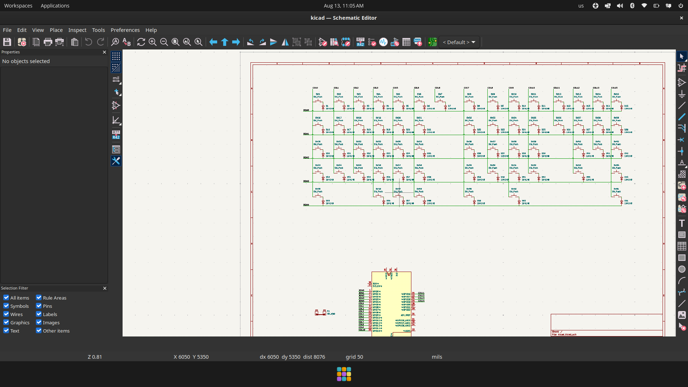

After this i added 5 stabalizers: 2.25u for shift, shift r, enter, 2u for left space key and 3u for right space key. then for mounting holes, i chose top mount as it seemed it had not much cons and bad ux henxe didn't add mounting holes(as it will be added in case afaik..). then i assigned footprints to every component though many already had and this was all for schematics..

Though i wanted to add rgb lights, and other things but i was worried i might mess up hence decided to build a simple one first..

## PCB Designing - Aug 13 - 18:36 (took 4h 20m) - [[vid1](https://lapse.hackclub.com/timelapse/YOkFsyImk0Pb), [vid2](https://lapse.hackclub.com/timelapse/Ex7zEscL5foG)]
Ok this was so fun! So after building schematics, i had to build pcb, i started by looking at others as i had no idea abt it, then i realized here i have to place and design components as i want the keyboard irl. so thats, what i did, i started placing switches and diodes one by one and the hard part was rotating and placing it such that it doesn't conflict.. then i completed it in ~2 hrs, though i am not confirmed whether i did right or not as i jst placed them as i thought was right not with exact measurements. btw this is what i got:
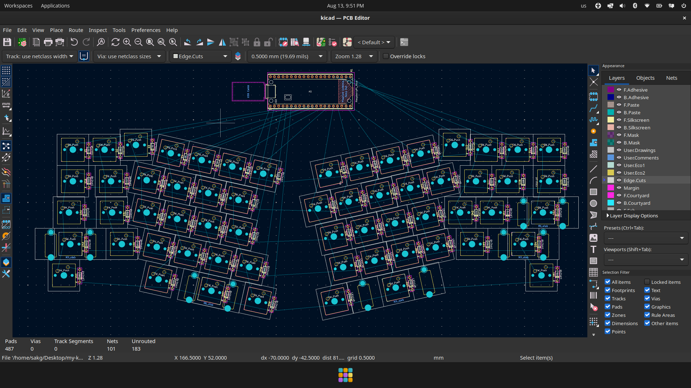

 Alrit so i thought this was all for pcb but got to know now i would have to route traces.. i started by looking  at other's routed board and started mine, i tried routing one row but was confused as the traces were conflicting but soon realized how to do! at first i was trynna making it as clean as possble but at the end got to know that it must be as short as possible hence had to edit and make it short. I used F.Cu for rows and B.Cu for cols. Afterwards, i edited my avatar and used it as silkscreen in the pcb! But the problem was at last in the guide it was said to flood leftover copper traces with gnd but i didn't find gnd :( so i skipped this as DRC was success. heres the routed pcb:
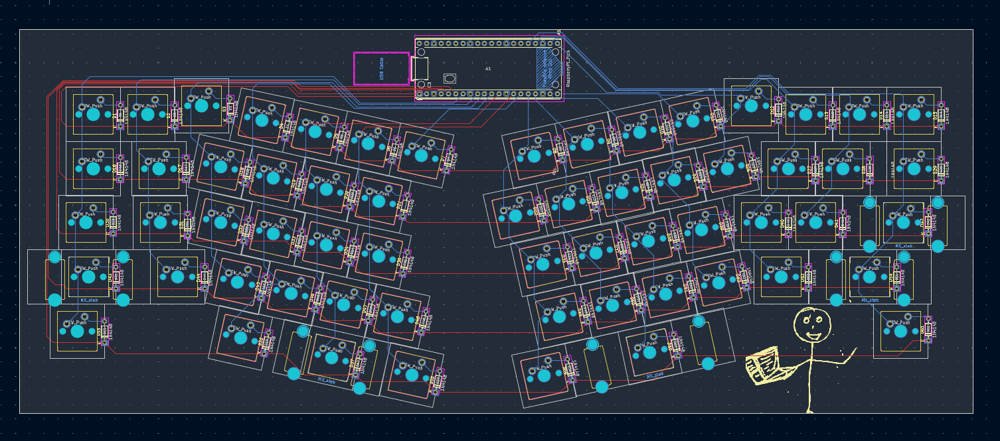

## Restarting Schematics part 1 - Aug 15 - 00:14 (took 2h 45m) - [[vid1](https://lapse.hackclub.com/timelapse/MzG8KxQDhcaJ)]
So i jst found out that i messed up in my pcb: using uneven space even smwhere the switch has less area than it needs, etc. as well as i wanted to add rgb backlight (which i wasn't adding as i thought it might be complex but.. worth trying)

Hence i rm rf my project(schemetics was saved in github lel) and started from schematics again. at first i spent an hr revising foundation concepts of electronics and pcb. I named this project keeb-2 as i wanted it to differentiate from first one.

I used the original schematics of prev and started editing it. i looked into others schematics for how they were formatting it and doing rgb and other.

i moved keyboard matrix into new sheet but had no idea how to do input output of wires so spent few time to figure out but failed and jst dmd one person and left it. then did sm formatting inspired by others schematic.

then i started researching abt rgbs and started implementing that, which took a little much time.. but now all the wires of different rows were conflicting so jst i shut down the laptop(didn't cmplt the rgb matrix)

## Schematics Part 2 - Aug 15 - 08:33 (took 2h 54m) - [[vid1](https://lapse.hackclub.com/timelapse/s9vvDBUa4eBe)]
i began the work i had left ystday: rgb matrix, after i did 2 rows. i asked my friend whether i was doing crrect or not and on the same time did sm more research to make sure i am doing correct. then i spent next 40 minutes making it for rest rows(4 more). then i spent sm time understanding how it was working and perfecting it.

Till then my friend had told me how to take input/output in sheets, so jst started encapsulating keyboard matrix and light matrix and replacing text with input pins, tbh it was so satisfying..

So i was neaarly done but few doubts i had: i was choosing GATERON G Pro 3.0 Keyboard Switches, what component and footprint do i have to choose? is it still sw push? then zwhat is diff between 45 deg tilted vs normal switch?, Which mounting is kinda best and do i need mounting holes? and would a single trace of 5V be enough for all 60 rgbs or not.

btw heres the schematics:

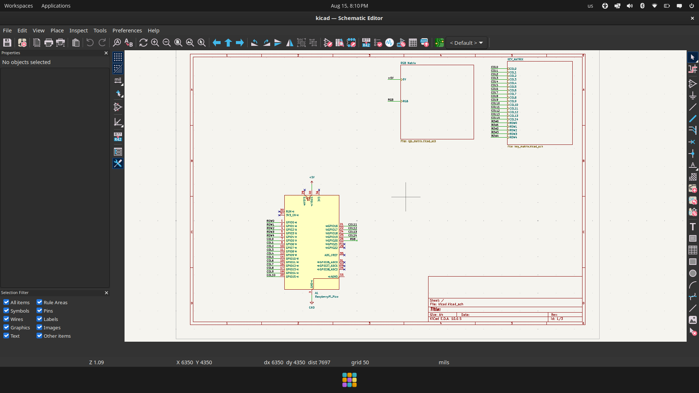
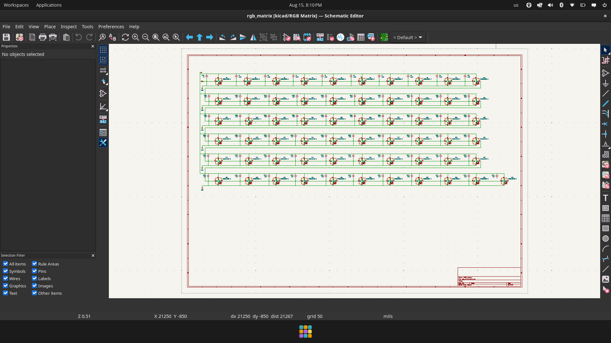
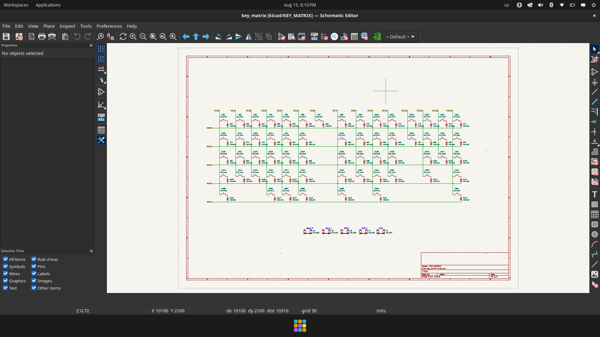

## Final Schematics - Aug 16 - 08:31 (took 55m) - [[vid1](https://lapse.hackclub.com/timelapse/G30fItRTDwur)]
so most of my doubt were clear now hence i began doing last part of schematics.

At first instead of providing a single 5v trace to all 61 rgbs, i did 6 seperate, then i added mounting holes even though i am doing gasket mount as it might be useful in future..

Then i started assigning footprint, many were already assigned as i am reusing the prev failed keeb schematics. it might have been faster had i not wanted to know why specific footprint we using. i started with capacitor but realized we also need a large capacitor that would seat near main 5v input b4 other in rgb matrix, so did sm research and used 470 uf capacitor. then added 330 ohm resistor in rgb data before first dinput.

then after verifying that i was doing everything right, i annoted the numbers, then assigned footprint of mounting holes, switch(normal to kailh for hotswappable), resistors and capacitors.

So finally schemetics is done - hopefully. Heres the img of my led matrix as i did few changes:
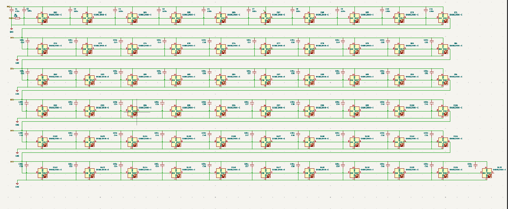

## Placing switches and diodes in pcb - Aug 16 - 10:30 (took 5h 23m !!) - [[vid1](https://lapse.hackclub.com/timelapse/cdlYKonsr0yP), [vid2](https://lapse.hackclub.com/timelapse/3-Le5tg14sAu), [vid3](https://lapse.hackclub.com/timelapse/bj1iuRdRYYz4)]
I needed to be careful this time.

I started by updating pcb from schematics, then added the grids(19.05, added half, quarter etc later). Then i began moving the switches inside the board, i was following layout but wasn't rotating or making exact alice like but jst a structure kinda(like normal keyboard). while doing this i messed up spacing multiple times bt hopefully fixed them as i notice. heres the img: 
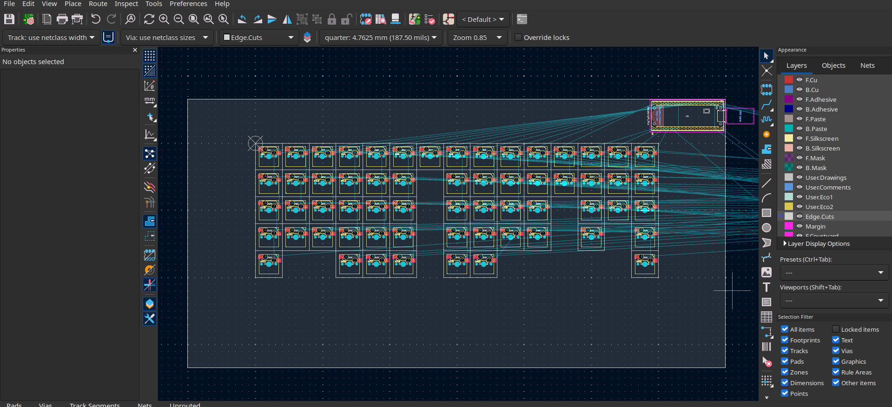

After this, i flipped all switches individually as i wanted the kailh socket in back. then did sm research to confirm am doing correct afterwards i started placing diodes in left side of switch but i was trynna flip it but it was conflicting with kailh socket so jst closed laptop.

So later i realized i can jst place it in front side so jst placed all diodes. And now i wanted to cnvrt it same as my layout but i didn't place rgbs in switch as it would have been harder to grab and rotate all three components together. so yep i started making it same as my layout, i started rotating, moving etc and tbh this was hardest as i had to make sure of space and position. I was in 2nd row and realized that when i was rotating and moving, i wasn't able move switches and other with the defined grids and was worried i might be missing smthing so jst closed laptop

Alrit later looked at others pcb and found out they also had sm space inconsistency so i js resume doing this. After replacing all switches i was done with it. then i redraw rectangle for the board. heres the image
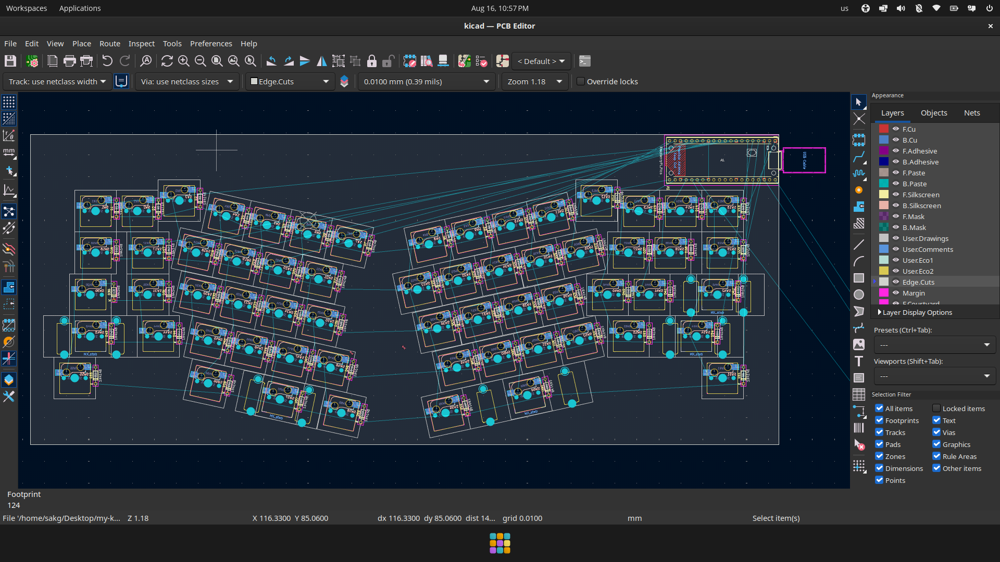

## Placing rgbs in pcb - Aug 17 - 08:34 (took 2h 24m) - [[vid1](https://lapse.hackclub.com/timelapse/EAJlNUQfDqrk), [vid2](https://lapse.hackclub.com/timelapse/DqyL5KlTACtc)]
Alrit so now only rgb is left to place in pcb!

I started by deleting extra capacitors in schematics and maintained a gap of a capacitor per 4 rgbs(which was enough and will be less pain while soldering). heres the img:
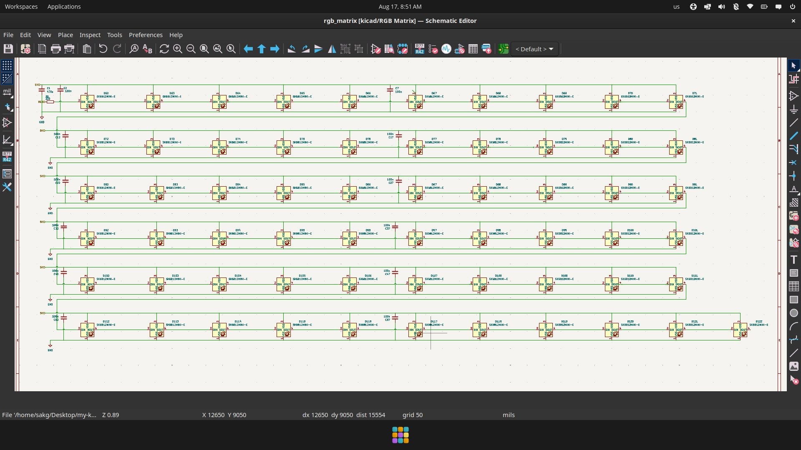

Then i updated pcb from schematics. I started placing rgbs in switches but after placing few realized they all were conflicting with their switches though the kailh socket was backside and rgbs was in front and they were not conflicting when both were in back side. but i want rgbs in front.. so did sm research but closed laptop.. heres the img of conflict: 
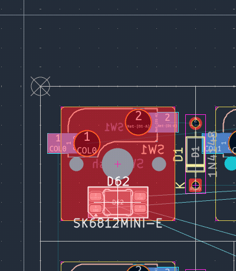

Ok heres me after a day, so the thing is... it was DAMN ez, "it wasn't a bug but a feature :>". Bcz turns out the rgb is reverse mounted that means it is supposed to be in backside of pcb and light will come through the hole!!

So i started by flipping the rgbs and placing them inside switches, initially i js placed them inside the switches then i placed precisely. Afterwards i noticed the referance names of rgbs were D_, which was same as of diode hence i individually changed refereance names of each rgb to RGB_ in schematics then updated pcb from schematics. heres the img:
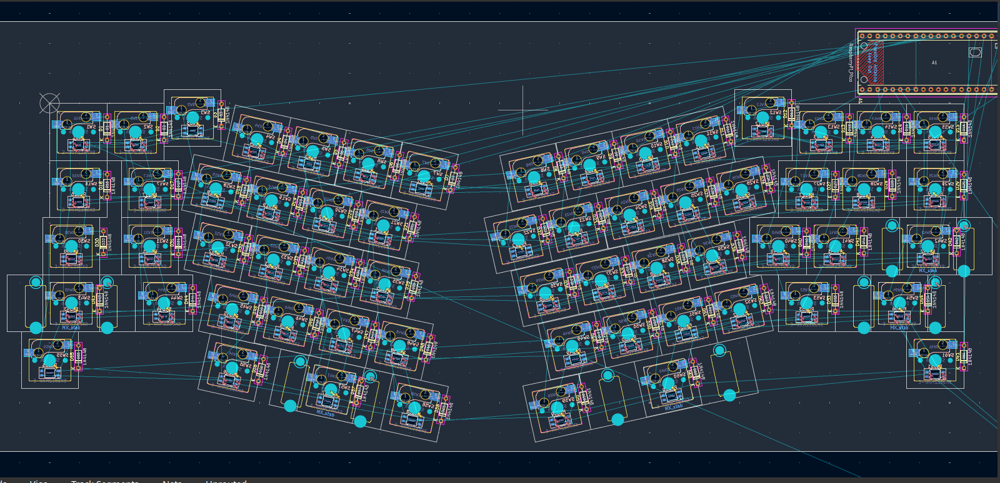

Afterwards i placed the mounting holes on the edges and middle of the pcb. 

Now only capacitors and resistor was left, i wasn't sure where to place them so looked at others and found it would be near the switch(while maintaining the gap of 4 switched..). So while looking at the rgb matrix of schematics, started placing the capacitors and resistor(it was holy lagging while switching between schematics and pcb). Here is the image: 
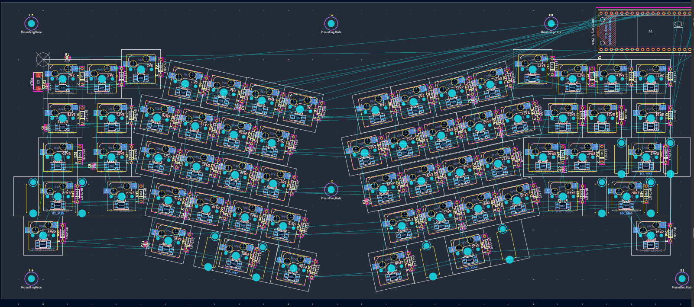

## Routing pcb - Aug 18 - 16:42 (took 4h 26m) - [[vid1](https://lapse.hackclub.com/timelapse/ouHZQnK8rh1N)]
So after many failed attempts(that i didn't record), i started by routing the individual diodes and their switches, then i started connecting the rows but i notices, since i wanted the traces to pass through middle of switch, i need to have some space between switch mid which was taken by rgbs, hence i started moving rgbs lil bit down and connecting the traces with diodes. the traces were zig zag when i was passing it through rotated switch but ig thats ok. then i routed column traces. Heres the img:
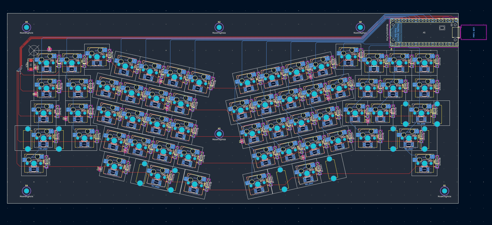

Ok now we had to route the rgbs and +5v across the pcb. At first i did lil bit of research as what way would be more efficient. Then I took a thick(~1mm) trace for +5v, and started it from the pico 40th pin and took it bottom then left and ended in the end of bottom left. My idea was to have a thick +5v traces then we branch it for every row. so after resolving sm mistakes, i started connecting the trace with the last row, used a via as rgbs needed blue traces(as they are flipped). 

But soon i realized if i start trace from right to left, it would conflict with the schematics of rgbs bcz i had placed the capacitors by assuming the +5v trace from left to right. hence i removed the left +5V trace and brought it to right side then bottom right. I started branching it into rows, ig i kept the branches traces 0.8 mm and 0.5 for the final trace that connects to the rgb. At first jst connected with every rgbs then started connectin with capacitors then did bit rearrangement.

Now power was done but many things were left like rgb data, gnd etc. I started routing the rgb data in out next, i took a normal trace and connected it with resistors then the rgb din. i had to add few vias while doing it bcz the rgb traces were conflicting with the column traces(as both were b.cu), but yeah i connected every rgbs' data input and output. btw while doing it, i saw sm data input or output pads weren't accepting the traces and i found out it was bcz of mistakes i had done in schematics but resolved it. Heres the img:
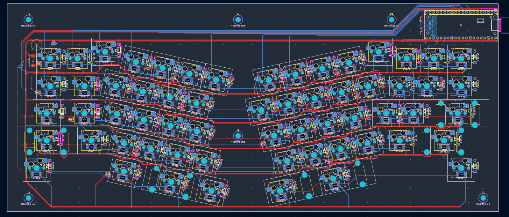

## PCB Routing part 2 - Aug 19 - 15:43 (took 3h 39m) - [[vid1](https://lapse.hackclub.com/timelapse/hr0nfcHYQDM3), [vid2](https://lapse.hackclub.com/timelapse/d2yHIfOvApwa), [vid3](https://lapse.hackclub.com/timelapse/KGxY6Ut_EcXD), [vid4](https://lapse.hackclub.com/timelapse/35E6xPwcAyC_)]
So now only GNDs were need to be connected but i found out, if we do GND fill, we don't need to manually connect all GNDS with each other. So after several(rlly) painful attempts(not recorded), i started by drawing a filled zone on both back and front copper layer, GND as net. I noticed several air pockets hence started adding vias there (in first did in b.cu then f.cu). also i noticed there were some ratsnest that were pointing to nowhere in top so added vias and did sm troubleshooting there too and ended up with 0 unrouted trace(actually idk why it was showing 1 but when ran drc, it was 0)

While adding vias in f.cu for removing air pockets, i ran DRC checks to see issues and started resolving that but i wasn't able to resolve all as well as didn't remove all air pockets in f.cu as i closed laptop.

then next day in morning, i started resolving rest of the drc issues. there was these two issues: Board edge clearance violation and thermal relief, ig there were 215 issues of these but even after doing research and asking few ppl, didn't solve it hence jst ignored these. Afterwards i removed the edge cuts which was rectangular and gave it an alice type shape and got sm issues which i resolved. then i added my avatar and name as silkscreen on the pcb. Heres the image:
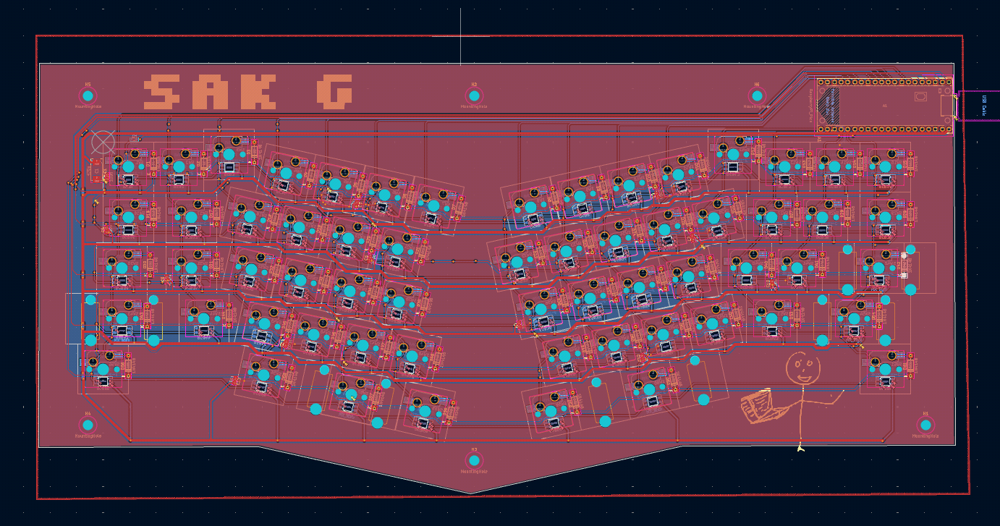

Now i did sm research and started generating bom.csv then started removing the air pockets of f.cu.(finally). Heres the img:
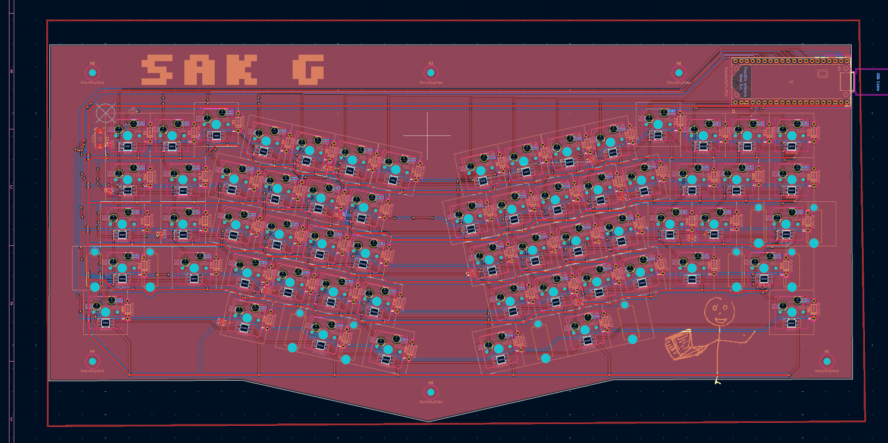

Now i realized i need to make the corners curved so watched a tutorial but while i was doing that i realized i messed up with diodes so had to redo the removal of air pocket as well as trouble shooting of drc errs. Then i made the corners curved. Ok then at last i added 3d models of switches then i exported it as gerber and zipped as `out.zip`. Heres the final pcb's 3d and normal img:
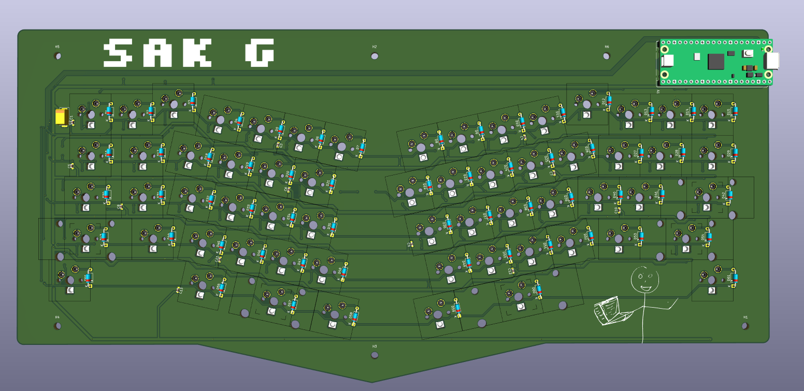
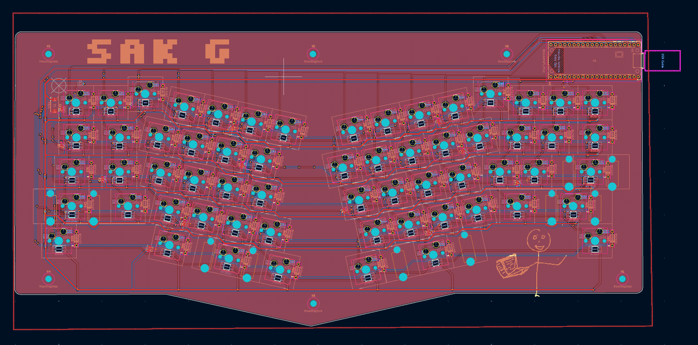

## Case Designing attempt 1 - Sep 07 - 10:09 (took 6h 36m) [[vid1](https://lapse.hackclub.com/timelapse/OvXzOiYZUe4G), [vid2](https://lapse.hackclub.com/timelapse/BVMXx6ve6AYw), [vid3](https://lapse.hackclub.com/timelapse/xVsu0WQh-wWo), [vid4](https://lapse.hackclub.com/timelapse/lH1MWFFoLUdn), [vid5](https://lapse.hackclub.com/timelapse/vZ_VEnhxBmsJ), [vid6](https://lapse.hackclub.com/timelapse/431a6qi_bVm1), [vid7](https://lapse.hackclub.com/timelapse/2cs6G5ezNLV6)]

{*its my third attempt doing it but didn't record those..*}
I started by following steps mentioned on guide, but was quickly lost, i spent 5 minutes figuring out how to import the 3d model exported from kicad which i had uploaded as document.

But soon figured out, then grouped all componenets in assembly and moved to center and created context.
then created a new sketch, cloned the borders of my keeb then did outward offset of 4mm and extruded it 5mm backward as base:
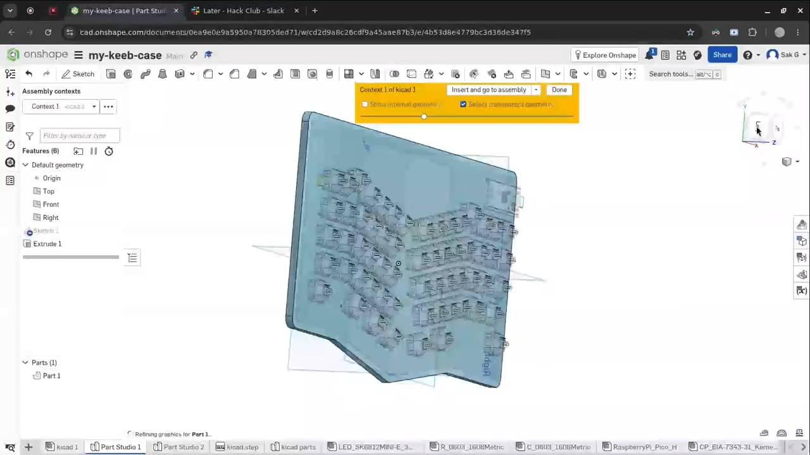

then i did the walls by making a new sketch and creating a border as of the base then inner border as inner offset of 3mm then extruded it 10mm up. there we go, we are done with bottom case for now:
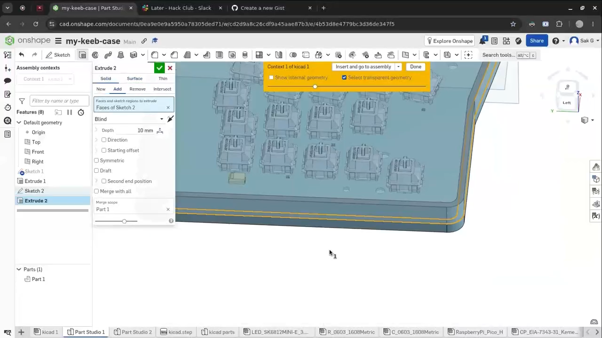

Now we had to design the plate, so i created a new sketch with plane as face of our context and border as the border of outer wall and extruded as new as we wanted it a seperate part, we needed holes for the switch but the Linear Pattern method didn't work as i have alice design and different spaces so i started creating a diagonal line on my switched then finding its center point and creating a 14x14mm rectangle then swapped its position with the center of switch and if needed, rotate it, and then i did it for every switches manually. But noticed i had to create a seperate plane at switches height not the face of context so created a plane and selected it:
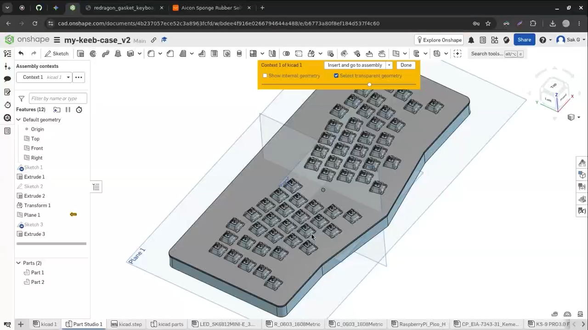

After this i realized there must be some gap between the pcb and bottom case(i was assuming it would be 0), so i selected the bottom case part and transformed it -5mm in Z axis, then i adjusted the measurements to make everything fit(you can see the correct measurements i end up using in the gist).

Now since we are done with plate for now, i started researching about gasket mount and planned to use gasket strips of 3mm thickness.
I saw in the diagram, i needed to make the plate lil smaller and give sm kind of holder where the gasket will be glued, SO i offseted the plates inward and then through manual work, started creating the tabs of 15x5mm for gasket on the center of edges(2 top, 1 left, 1 right and 4 bottom). Also i made sure there were some gaps between the case side and tabs so that they don't come in contact(though later realized it was very less..):
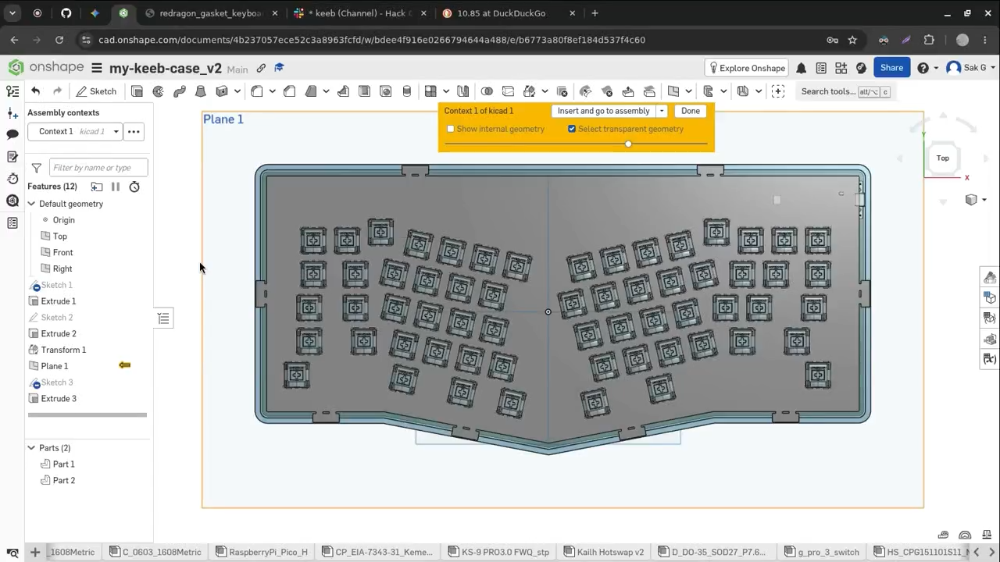

Now we had bottom case and plate with holes for switches and gasket tabs, but i needed gap of 2mm between the bottom of plate and top of bottom case as i had to place the 3mm gasket strips there(33% compressed: 3 - (33% of 3) is ~2). i saw i had gap of 0.5mm, so i edit the transformed value from -5mm to -6.5mm so that now we had 2mm of gap.

then i saw that the raspberry pi was touching the plate so in the sketch of plate, i drew the border of rasp pi, offset it 2mm then removed extra edges:
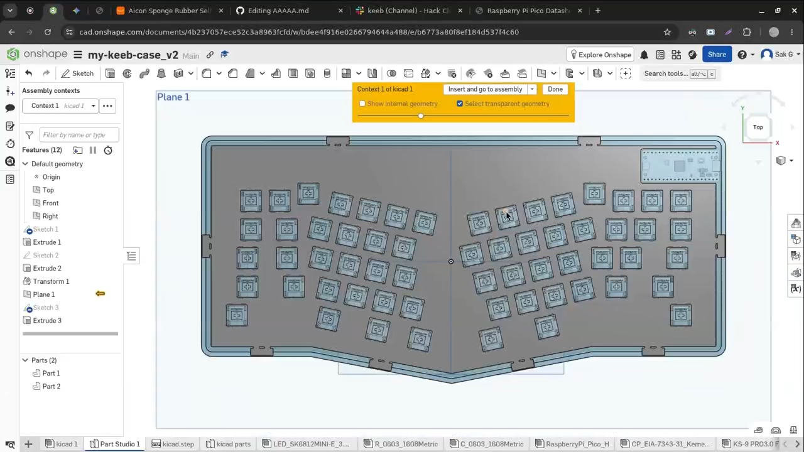

Then i created another plane, 2mm above the plate for top case and created a new sketch on that plane, then i copied the outward border of bottom case then i extruded the sketch by 5mm as new as we want seperate part. Afterwards i thought i needed all switch holes on top case as it was in plate so i copied the sketch of plane and pasted on top case's sketch, removed the gasket tabs, did sm adjustments and did outward offset to match the size of our border - took 2-3 attempts
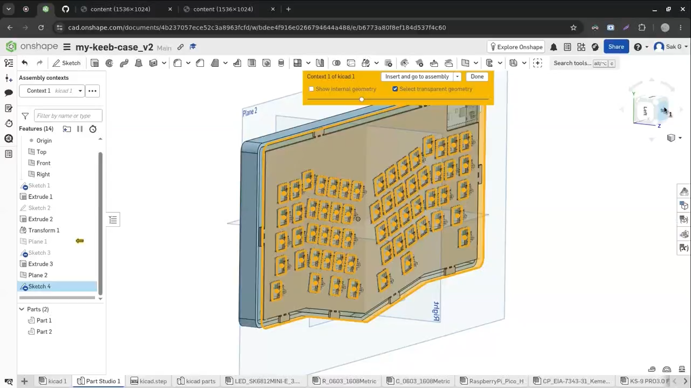

After watching some referance images of top case, i realized i don't need indiviual holes for keycaps rather there will be big hole, hence i deleted all the switch holes from top case sketch.

then in the sketch of top case, i drew inner holes like the ref(zig zag kinda) and adjusted it such that it doesn't conflict with the keycap and have some spaces(more than 19mm ig) also looks kinda cool:
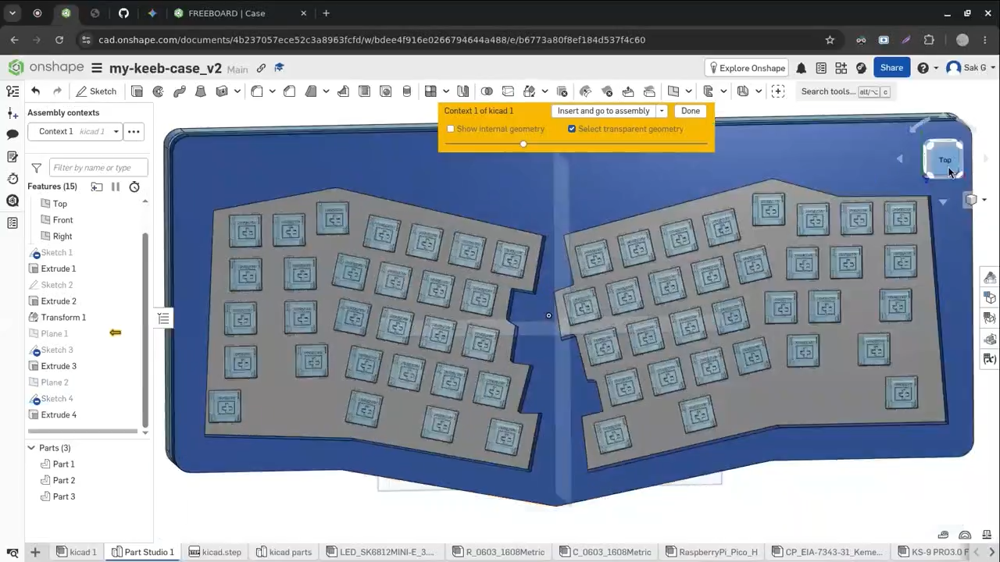

now the front part of top case was and we had to work for walls. so i created a new sketch, i copied the border of top case and offseted it 5mm externally then did an extrude downward of 25 mm(as it was the total height of my keeb) and appended it with top case extrude:
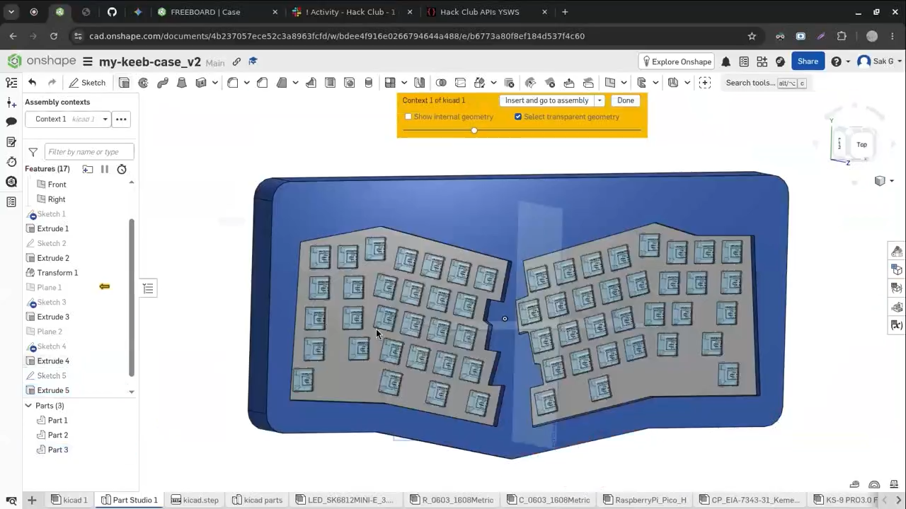

then i did sm checks to make sure its not conflicting with any other parts then for usb opening, i created another sketch and added a rectangle of size 5x10mm in the center of usb port. then extruded it, selected remove with part 3(top case) as merge scope and depth be 5mm.

soon i realized that i have keycaps of size more than 1u but the holes i had in top case were for 1u hence had to kinda recreate the holes and heres the final look:
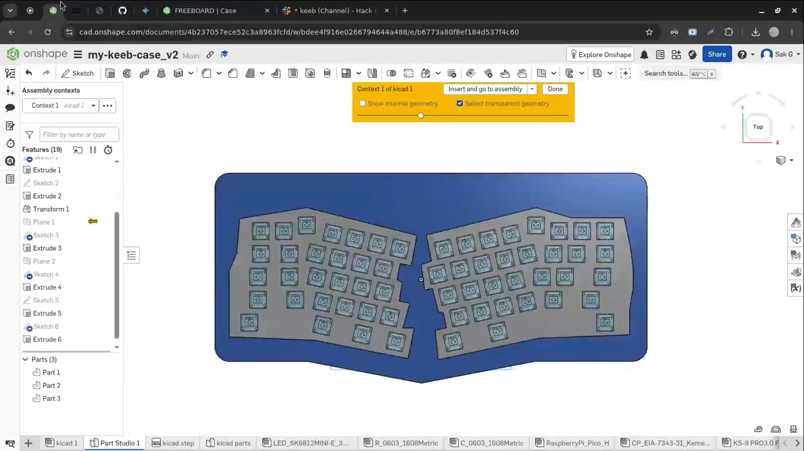

Now since we were done with all three parts(top and bottom case, and plate), i had to work on the screw thingies so that i can assemble them and disassembble as my will. I thought of 2 steps: first is adding plastic pillars of diameter 5mm then screw hole inside it as these holes were supposed to be in middle between the wall and empty area.

hence i created a new sketch in the face of bottom case, then on all side, i created a circle of diameter of 5mm and also in mid(as i thought it would be a good idea, but i had to add a hole in plate too). then i extruded it upward 15 mm that it comes in same level as top of walls of my bottom case:
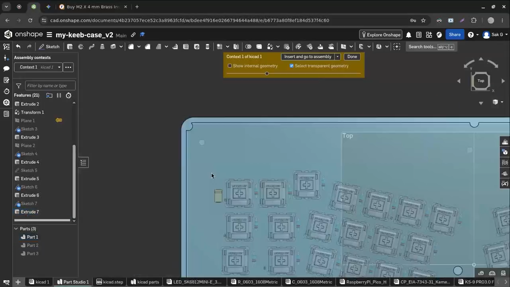

then for top case pillar, created another sketch in face of top case, and create circles same as did for bottom case pillars of same diameter and extruded downward 9mm(5mm for the top case and 4mm as extended):
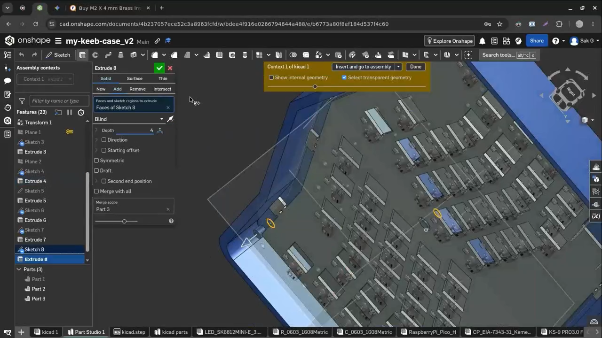

Now once we had pillars, i started creating holes for heat seat thingy. i created a new sketch on bottom face of top case pillar. i created circle of 3.6mm diameter in the centers of the pillars and extruded and remove 4.2mm so that the heatset would sit there. 
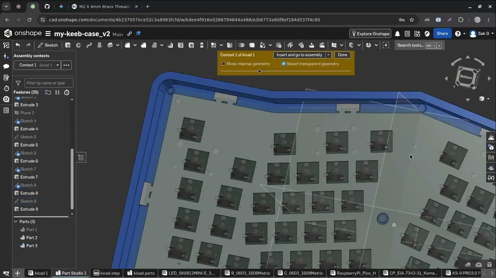

now we needed holes on the bottom case for the screw to pass. I thougt to get the screw from bottom to top. Hence i created a new sketch on the bottom face of bottom case, created circles of diameter 5mm and matched its position as the pillars then downscaled it to 2.4mm as the screw pipe would be nearly 2mm ig. Then i extruded it 15mm upward, selected remove and yeh we got the first hole, then created another sketch on the same face and with the same centers as of the hole, created another circles of 3.8mm for keeping the head of screw then extruded the sketch 11 mm upward and remove:
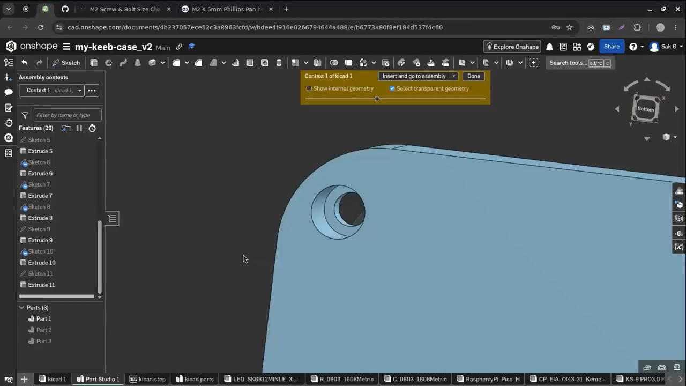

WELP AFTER THESE ALL, I REALIZED I HAD MESSED UP IN MANY PLACES, LIKE WHERE I WAS THINKING TO PLACE THE SCREWS, THERE WAS THE PCB WHICH I HADN'T NOTICED, I HAD VERY LESS GAPS BETWEEN GASKET TABS AND THE OUTER WALL AND MANY OTHER MISTAKES HENCE I THOUGHT TO REATTEMPT D:

## Final Case Designing: Prerequisite, start and essentials - Sep 18 - 21:33 (took Xh Ym) [[vid1](https://lapse.hackclub.com/timelapse/OkyDbiONVOZg), [vid2](https://lapse.hackclub.com/timelapse/_BrwjxEgn1dI), [vid3](https://lapse.hackclub.com/timelapse/OXWLNhOe6tsM)]

Soooo yeh ts gonna be last attempt for sure.. Ts time i would use more systematic and accurate ways aaaaaaaaaa

Very first thing i thought to do was to use keycaps on my pcb so that i could get correct idea of dimensions, hence i downloaded the cad models of all size of keycaps from grabcad. Since it was a single file for all keycaps, i seperated the required keycaps and exported manually. Then in footprint editor, i added 1u keycap in the footprint of all switches.

then i opened pcb editor and started changing the keycap models of switches which were for bigger keycaps(like 1.5u etc). It was kinda time taking process as i had to do try and err to see if the keycap was in correct position and orientation or not: 
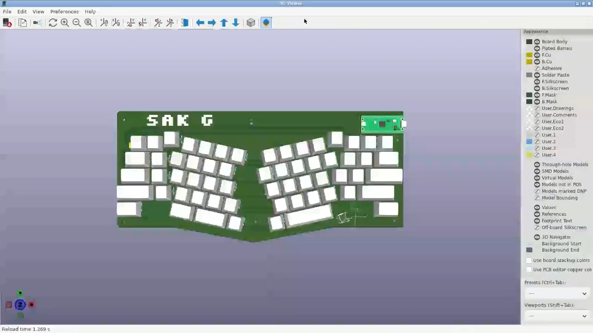

Then i exported the step file and gerber again. Created a new document in onshape.

As previous, uploaded the step model in the document then in assembly, grouped all components together, moved to center and created a new part studio with the context of it.

btw this time i would write the name of sketches, extrude, plains etc for clarity :D

Created first sketch, cloned the borders of pcb and ofsetted 8mm outwards then extruded the sketch 5mm downwards, creating a base.

Created another sketch for walls, cloned the border of base created one more rectangle with inward offset of 3mm. extruded the wall 10mm.

Then selected the part 1(base and wall), transformed and moved to -5 in z axis, creating a 5mm gap between the pcb and base:
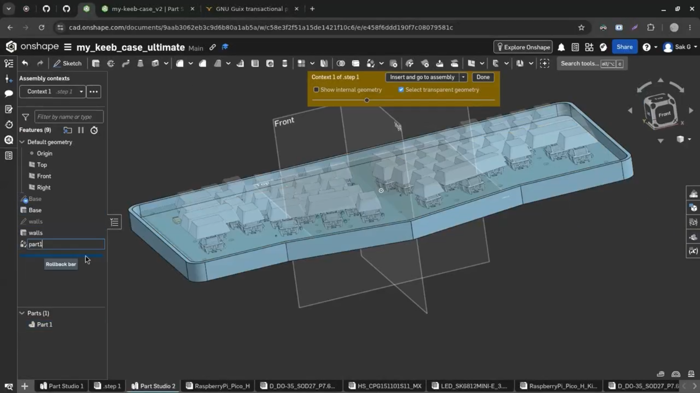

Now we were done with bottom case for now so created a plane, face of context 1 as entity and did offset of 4mm for the plate. Created a new sketch on the plate and cloned the border of pcb. Then after few checks, Now i had to add holes for the switches.

But it was kinda like a problem bcz for creating holes of 14x14mm i needed to know the center of switch but since there were keycaps on top of swiches, i couldn't do that also the center of keycaps weren't always the center of switches :(
So after some troubleshooting, i got to know that i was able to control the tranperency of specific components in assembly so yeh did that and was able to access the switch.
So through that same painful manual way as i did previously, i created 14x14mm holes for all the switches.

Then i increased the visibility of keycaps again, extruded the plate sketch by 1.5mm as new and heres the look:
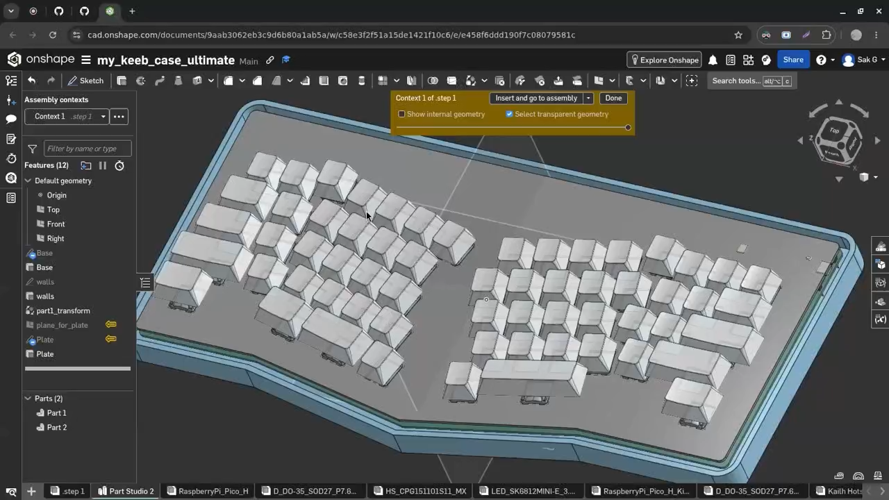

Afterwards, i edited the plate sketch on the center of left side, i created a rectangle of 15x5mm as gasket tabs and kept its center 4mm away from the plate side(2.5mm for the tabs and 1.5mm for the pipe). Also i created the 2 pipes on 2 sides of the gasket tab attached with the plate.

Then i repeated the gasket tabs for other sides -- 2 on top, 1 on sides, 4 on bottom.
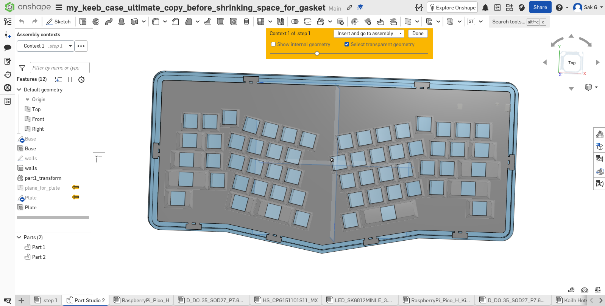

Then i extended the inner wall of bottom case from 3mm offset to 6.5 so that we got enough space for the screw to fit.

Also i made the offset 3.3 mm instead of 4mm for the plate plane so that switched sits correctly in plate and transformed the bottom case(part 1) from 5mm to to 7.2 mm such that now we had gap of 2.01 mm which was exactly 33% compression of our 3mm gasket strips!

Then on the sketch of plate, i cloned border of pico and offset it 1mm outward and connected with the plate sketches such that now we had hole for pico too:
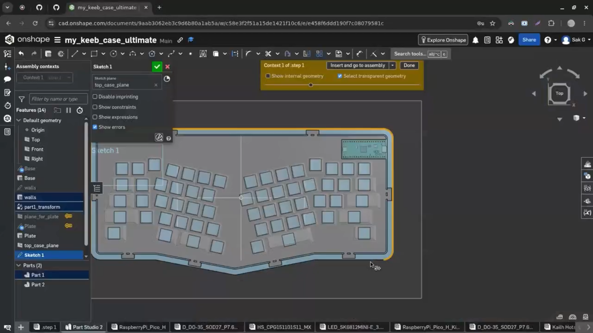

So once we were done with bottom case and plate, it was time for the top case so i created a plane with offset 2.01mm from face of plate then created a sketch on the plane and copied the border of bottom case and extruded the sketch by 5mm as usual. 

Then i defined the polygons through lines for the holes in the top case sketch while keeping the keycaps size, distance and other things in mind, tbh it was easier and more accurate here as i had the 3d models of the keycap.

Then for the top case wall, i created anothe sketch in the face of top case, copied borders of top case and made an offset of 5mm outwards. And extruded it downwards ~25mm in part 3 such that it coverts whole keyboard like shoebox.

After that i created a new sketch on the side of wall and i found the center of usb port and created a rectangle of 10x5mm for usb port opening and extruded it 5mm and remove in part 3:
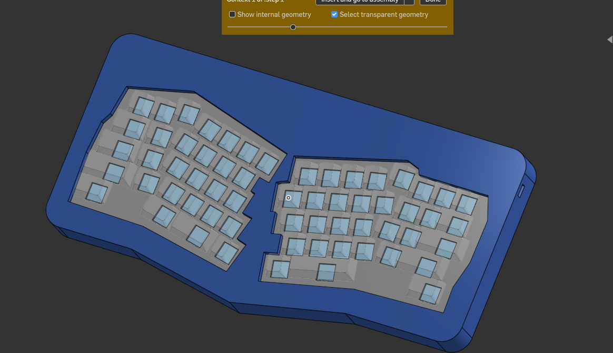

So now since we are done with top and bottom case and plate, we had to work on screw thingies again :>, so i created a new sketch on bottom face of top case added circles of diameter 5mm for plastic pillars, though didn't add in center of pcb this time as we didn't have any hole there.. Anyways after that i extruded the sketch 4mm downwards.

Then i created another sketch on face of the cylindrical pillar we js created, for the holes for heatset inserts. On the same centers as the pillars, i created cirles of diameter 3.6mm then extruded the sketch by 4.2mm and selected remove:
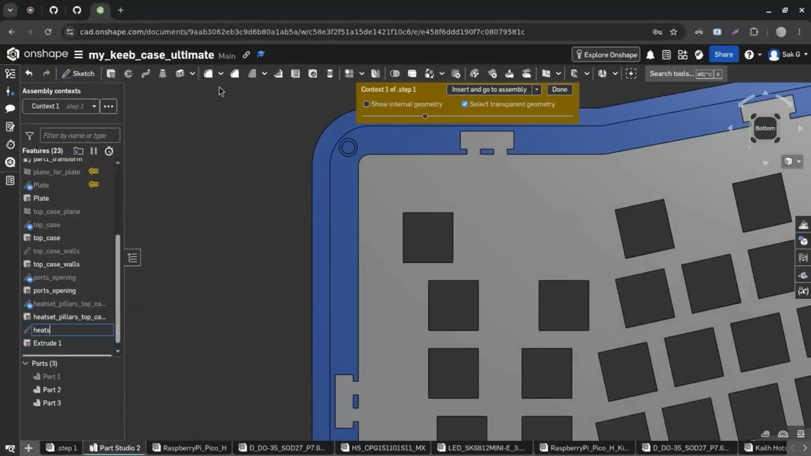

Now i had to do screw things for bottom case, here there were 2 parts; the head and the body.
For body first, i created a new sketch on bottom face of bottom case and selected the top case holes, clones all and resize them to 2.4mm. Then i extruded the sketch, 15mm and remove.

Now for the head, i created another sketch on bottom face of bottom case and js like previous, cloned the circles but resized them to 3.8 mm then extruded it to 10.5mm remove(which i found through sm calculations mentioned in steps in gist):

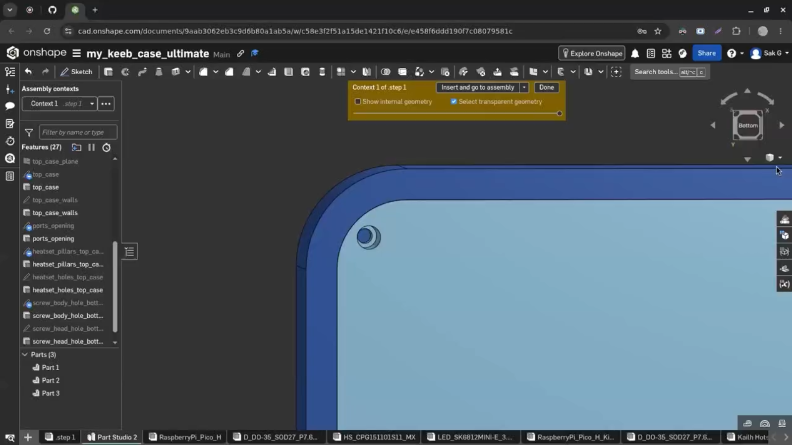

